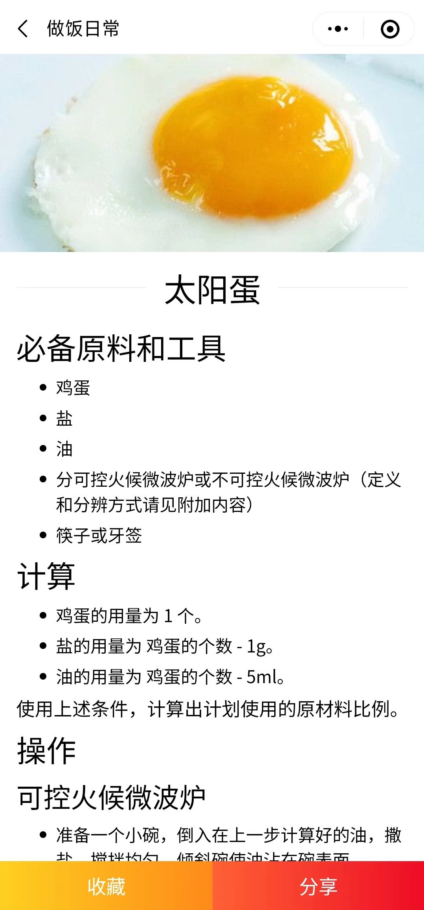
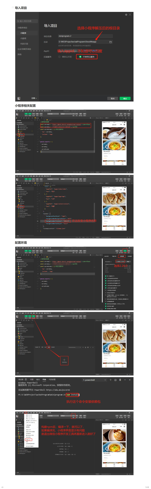

# GhostWeapp
> 一个简单的Ghost微信小程序，基于Ghost api

### 功能

支持搜索（Ghost没有提供搜索api，但参考Ghost目前支持的搜索实现，使用文章列表api，对10000条数据进行模糊搜索）

首页轮播图（ghost后台将文章标记为featured即可）

分类（基于ghost标签）

文章收藏（无需登录，使用本地存储数据）

### 用到的库

vant weapp

mp-html

### 预览

### 运行教程

> README_img文件夹是README.md说明文档的图片存放目录，可以删除
>
> 配置大概步骤：导入项目、配置环境、填写Ghost api、小程序名称即可
>
> 下图是详细的配置教程

### 后续维护？

大概不会了，但本项目简单，很容易上手，可以自己完善
